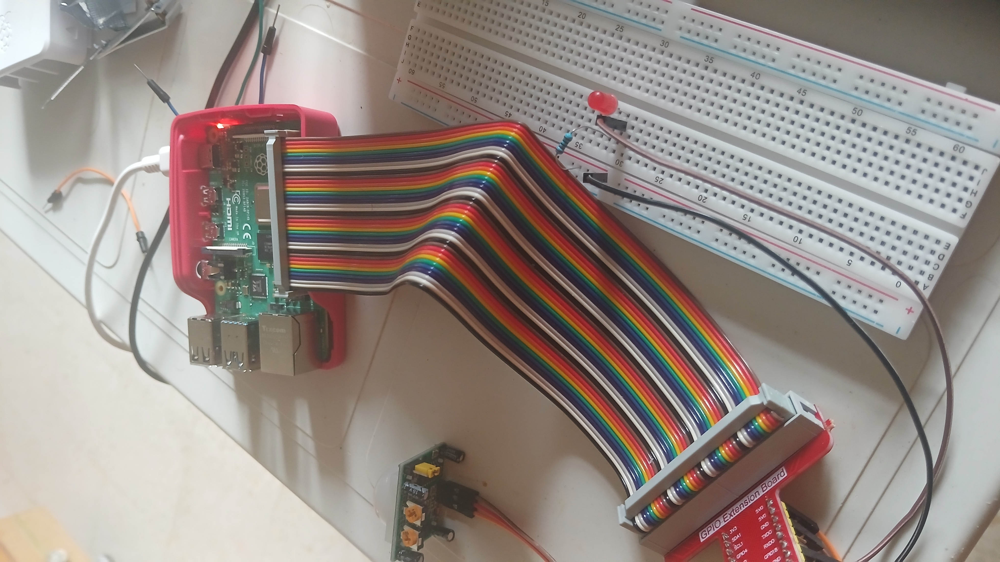

## Motion Detection Using WiringPi (C, CMake, Toolchain)

This project demonstrates how to use a motion detector with WiringPi in C on a Raspberry Pi. The motion sensor detects movement and triggers an action, such as toggling an LED or activating another component. The following tools and technologies were used:
- **WiringPi**: A GPIO library for the Raspberry Pi.
- **CMake**: For build configuration.
- **Toolchain**: Cross-compiling from a host machine to the Raspberry Pi using a custom toolchain.

### Features:
- Detects motion through a PIR (Passive Infrared) sensor on a GPIO pin.
- Toggles an LED or other connected components based on motion detection.
- Uses WiringPi functions to manage GPIO inputs and outputs.
- Cross-compiled from a host system and deployed to Raspberry Pi via SSH.

### Setup Diagram

### Watch the Demo

[Watch the video demonstration of the motion detection functionality](https://www.youtube.com/shorts/K4Nq5pkwRzs)
